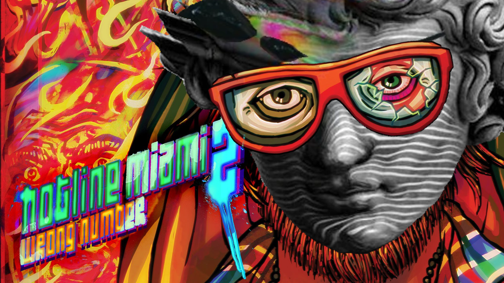

# Hotline Miami 2 SiIvagunner Mod

Enjoy Hotline Miami with _all_ the high-quality SiIvagunner and Timmy Turner's Grand Dad rips!

## How to Use

1. [Download the newest release](https://github.com/perguto/Hotline-Miami-2-SiIvagunner-Mod/releases/download/v1/hotline_miami_2_siivagunner_mod_v1.zip) and unzip it.
2. Find your Hotline Miami 2 folder (contained in "SteamLibrary/steamapps/common" if downloaded from Steam) and make a safety copy of 
3. Download the [HLMWadExplorer](https://github.com/TcT2k/HLMWadExplorer/releases) (Direct Download Link: https://github.com/TcT2k/HLMWadExplorer/releases/download/v1.0.0/HLMWADExplorer-1.0.0-win32.zip)
4. Open the HLMWADExplorer, select "hlm2_music_desktop.wad" as the base wad, click on "File" and the "Merge patch" and select the "hlm2_music_desktop_siivagunner_mod.patchwad" file you got in step 1.
5. Finally save the patched file (`File` > `Save`). If you forgot to make a backup in step 2., choose the "make a backup" option.

Now your done and you'll hear the rips once you start the game! To switch back to the normal version, just rename "hlm2_music_desktop.wad" to something else and restore the original "hlm2_music_desktop.wad" you kept as a backup.
